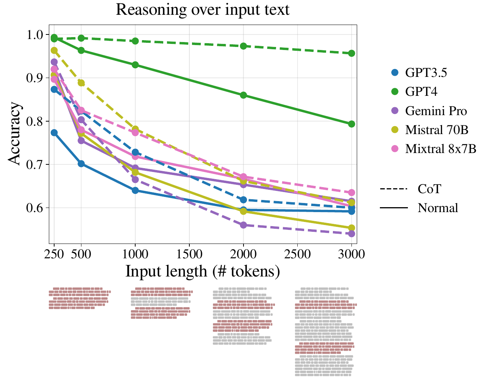
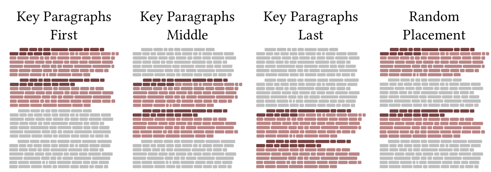

# 
Same Task, More tokens

##  
the Impact of Input Length on the Reasoning Performance of Large Language Models

Mosh Levy[*,1], Alon Jacoby[*,1], Yoav Goldberg[1,2]
 

## What is this all about?
We explore the impact of extending input lengths on the capabilities of Large Language Models (LLMs). 

Despite LLMs advancements in recent times, their performance consistency across different input lengths is not well understood.

Here, we aim to change that by isolating the effect of input length and studying when, and how models fail to respond correctly to QA reasoning tasks.

## How to investigate the impact of length
We investigate this aspect by introducing a novel QA reasoning framework, our [**FLenQA Dataset**](https://github.com/alonj/Same-Task-More-Tokens/), specifically designed to assess the impact of input length. We isolate the effect of input length using multiple versions of the same sample, each being extended with padding of different lengths, types and locations.

## What we found
Our findings show a notable degradation in LLMs' reasoning performance at much shorter input lengths than their technical maximum. We show that the degradation trend appears in every version of our dataset, although at different intensities.

Additionally, our study reveals that the traditional metric of next word prediction correlates negatively with performance of LLMs' on our reasoning dataset.

We also identified failure modes that can serve as useful guides for future research, potentially informing strategies to address the limitations observed in LLMs.

## Analysis notebook
[The notebook](https://github.com/alonj/Same-Task-More-Tokens/blob/main/FLenQA%20analysis.ipynb) should help you analyse and evaluate models of your choice. We demonstrate all the necessary steps on GPT-3.5 Turbo (Version 1106)

It shows how to:

- Load the data, and the prompts we used for each task within our dataset.
- Get results from the model of our choice (example includes GPT-3.5 Turbo) and perform all the basic processing steps needed for our analysis later.
- Get basic plots to visualize how model accuracy declines over longer input.
- Perform the kind of analysis we have in our paper on Chain-of-Thought prompting.

*: Authors contributed equally to this work.  
1: Bar-Ilan University  
2: Allen Institute for AI  
